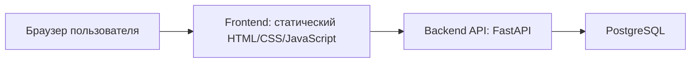
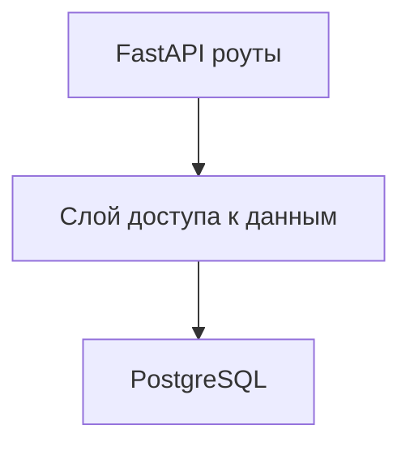
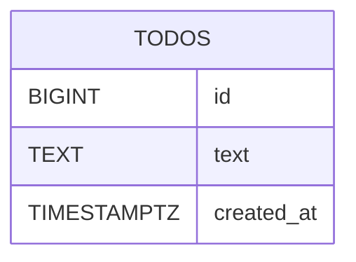

## 1. Проектирование архитектуры



Архитектура намеренно минимальна: статический frontend обращается к backend API, backend работает с PostgreSQL и сам подготавливает таблицу `todos` при старте. Внешние сервисы, авторизация и фоновые процессы не используются.

## 2. Описание технологий
- Frontend: статический HTML + CSS + JavaScript
- Web-сервер frontend: nginx в отдельном контейнере
- Backend: Python 3.12 + FastAPI + Uvicorn
- Работа с БД: psycopg 3
- База данных: PostgreSQL 16
- Локальный оркестратор: Docker Compose
- Инициализация: без фронтенд-сборщика и без отдельного ORM-слоя, чтобы сохранить проект простым

## 3. Определение маршрутов
| Маршрут | Назначение |
|---|---|
| / | Главная страница со списком Todo и формой добавления |

## 4. Определение API

### 4.1 Endpoint'ы backend
| Метод | Путь | Назначение |
|---|---|---|
| GET | /todos | Вернуть список всех Todo |
| POST | /todos | Создать новую Todo |
| DELETE | /todos/{id} | Удалить Todo по идентификатору |
| GET | /health | Вернуть признак работоспособности backend |

### 4.2 Схемы запросов и ответов
```ts
type Todo = {
  id: number;
  text: string;
  created_at: string;
};

type CreateTodoRequest = {
  text: string;
};

type HealthResponse = {
  status: "ok";
};
```

### 4.3 Поведение API
- `GET /todos` возвращает массив Todo, отсортированный по `id`
- `POST /todos` принимает JSON с полем `text`, создаёт запись и возвращает созданный объект
- `DELETE /todos/{id}` удаляет запись и возвращает пустой успешный ответ
- `GET /health` возвращает успешный ответ, если backend-процесс запущен и может обработать запрос

## 5. Серверная архитектура



Backend не делится на сложные доменные слои. Для учебного workload достаточно простых роутов и небольшого модуля работы с PostgreSQL.

## 6. Модель данных

### 6.1 ER-диаграмма


### 6.2 DDL
```sql
CREATE TABLE IF NOT EXISTS todos (
    id BIGSERIAL PRIMARY KEY,
    text TEXT NOT NULL CHECK (char_length(trim(text)) > 0),
    created_at TIMESTAMPTZ NOT NULL DEFAULT NOW()
);
```

## 7. Переменные окружения
| Переменная | Назначение |
|---|---|
| POSTGRES_DB | Имя базы данных PostgreSQL |
| POSTGRES_USER | Пользователь PostgreSQL |
| POSTGRES_PASSWORD | Пароль PostgreSQL |
| POSTGRES_HOST | Хост PostgreSQL для backend |
| POSTGRES_PORT | Порт PostgreSQL для backend |
| BACKEND_PORT | Порт запуска backend внутри контейнера |
| FRONTEND_PORT | Порт публикации frontend при локальном запуске |
| API_BASE_URL | Базовый URL backend API для frontend |
