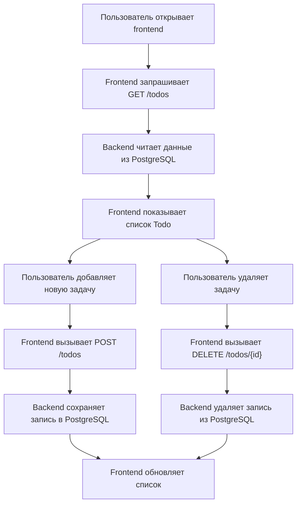

## 1. Обзор продукта
Минимальное веб-приложение Todo нужно как учебный workload для практики DevOps-инфраструктуры вокруг реального, но простого сервиса.
- Основная цель: дать небольшой frontend, backend API и PostgreSQL, которые можно локально запускать, контейнеризировать и затем переносить в Kubernetes.
- Ценность проекта: служить понятной и предсказуемой базой для изучения Docker, Compose, Kubernetes, observability, CI/CD и смежных DevOps-практик.

## 2. Ключевые возможности

### 2.1 Функциональные модули
1. **Веб-страница Todo**: просмотр списка задач, форма добавления задачи, удаление задачи.
2. **Backend API**: операции получения, создания и удаления Todo, а также health-check endpoint.
3. **Хранение данных**: сохранение Todo в PostgreSQL с автоматическим созданием таблицы при первом запуске.

### 2.2 Детали страниц
| Название страницы | Название модуля | Описание функции |
|---|---|---|
| Главная страница | Список Todo | Загружает текущие задачи с backend API и отображает их в виде простого списка |
| Главная страница | Форма добавления | Позволяет ввести текст новой задачи и отправить POST-запрос |
| Главная страница | Удаление задачи | Позволяет удалить задачу по кнопке рядом с элементом списка |
| Главная страница | Статус API | Показывает базовое состояние загрузки и ошибки при обращении к backend |

## 3. Основной процесс
Пользователь открывает frontend, страница запрашивает список задач у backend. При добавлении новой задачи frontend отправляет запрос на создание, backend сохраняет запись в PostgreSQL и возвращает результат. При удалении frontend вызывает endpoint удаления, backend удаляет запись из базы и frontend обновляет список.

## 4. Дизайн интерфейса
### 4.1 Стиль
- Основной подход: предельно простой учебный интерфейс без декоративных усложнений
- Цвета: светлый фон, тёмный текст, один нейтральный акцент для кнопок
- Кнопки: простые прямоугольные или слегка скруглённые
- Шрифты: системные или максимально стандартные web-safe шрифты
- Компоновка: одна колонка, центрированный контейнер, минимальные отступы

### 4.2 Обзор страницы
| Название страницы | Название модуля | Элементы интерфейса |
|---|---|---|
| Главная страница | Заголовок | Название приложения и краткое описание назначения |
| Главная страница | Форма | Поле ввода текста и кнопка добавления |
| Главная страница | Список | Элементы Todo с текстом и кнопкой удаления |
| Главная страница | Сообщения | Индикатор загрузки, пустого списка и ошибок API |

### 4.3 Адаптивность
- Подход: desktop-first с корректной работой на обычных мобильных экранах
- Интерфейс должен оставаться читаемым и работоспособным без отдельной мобильной логики
